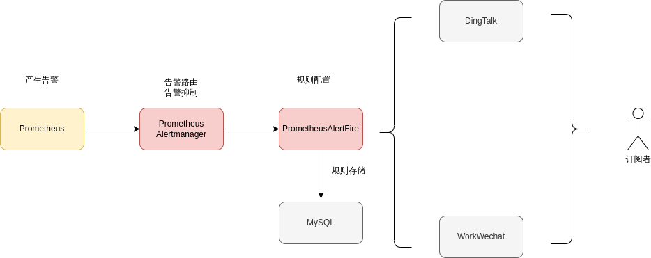
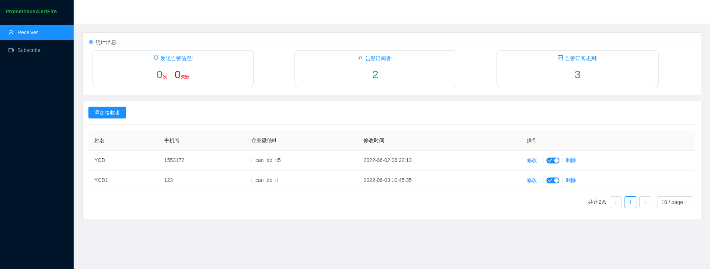
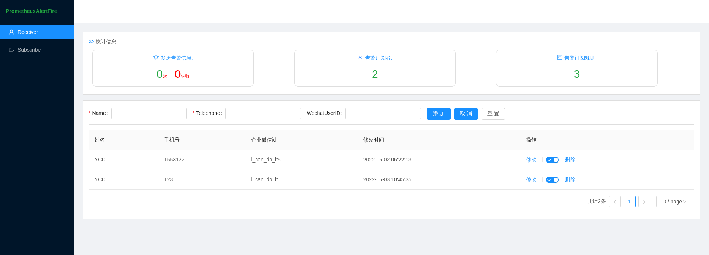
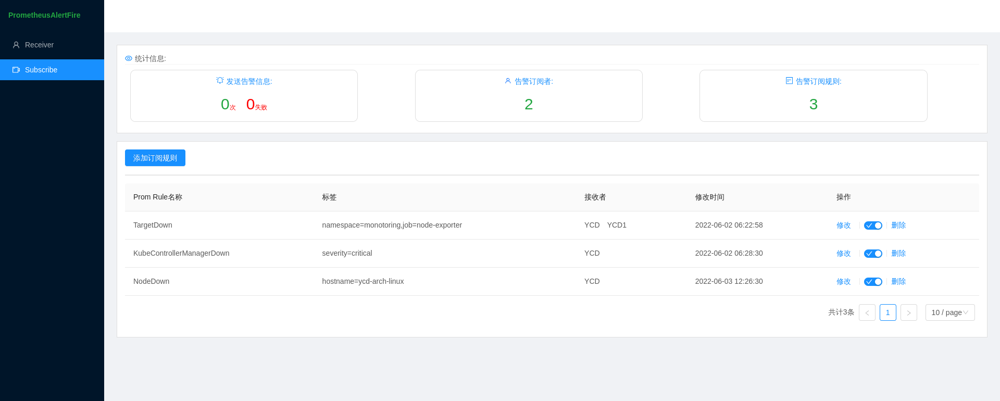
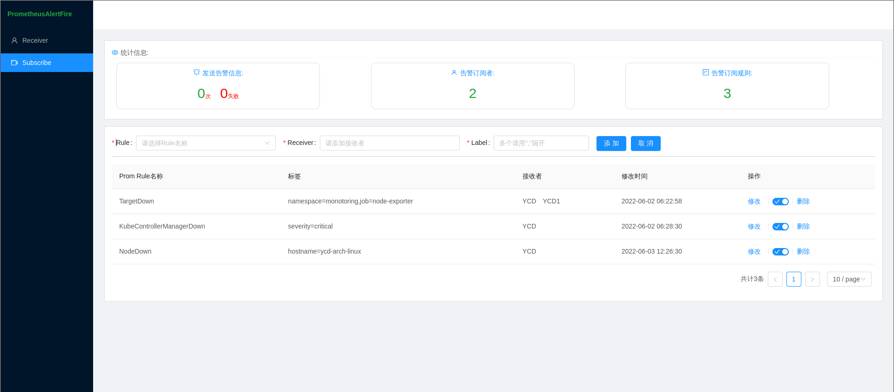
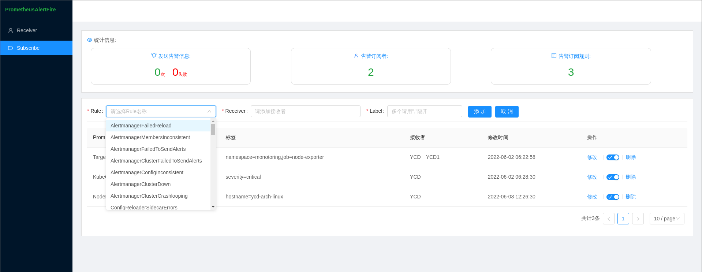

## `PrometheusAlertFire`
虽然`prometheus alertmanager` 可以定制路由告警，还可以通过匹配`label`的方式发送告警信息，但是人员过多管理起来就不会那么方便了。

`PrometheusAlertFire`可以很好的处理如下痛点：
* A同事只关注`MySQL`类的告警，不需要关注主机相关的告警。可通过钉钉或者企微机器人@A同事
* 可以配置静默时间段，在静默期只会发送已经订阅的告警项(未来可支持阿里云电话)

`PrometheusAlertFire`可以很好的处理如上的场景。

## 功能

* 支持钉钉、企微机器人
* 支持静默时间段（只会发送已订阅的消息）

## 架构图


## 未来
* 集成阿里云电话
* 可发送多个通知渠道，不同的`接收者`可添加自己的通知渠道，如：钉钉，微信
* 登入管理

## 部署
目前只提供二进制的方式,在[relases](https://github.com/YouCD/PrometheusAlertFire/releases)页面下载
1. 添加至 `prometheus alertmanager`
这是`prometheus alertmanager`配置案例

```yaml
cat alertmanager.yaml 
global:
  resolve_timeout: 5m
route:
  receiver: default
  group_by:
  - alertname
  routes:
  - receiver: default
    matchers:
    - alertname =~ "InfoInhibitor|Watchdog"
  group_wait: 30s
  group_interval: 10s
  repeat_interval: 10s
receivers:
- name: default
  webhook_configs:
  - send_resolved: true
    http_config:
      follow_redirects: true
    # 这里填写 PrometheusAlertFire 的地址，url必须为 `/api/alert`
    url: http://192.168.200.1:8012/api/alert
    max_alerts: 0
templates:
- /etc/alertmanager/config/*.tmpl

```

3. 创建数据库
```SQL
create database PrometheusAlertFire charset utf8mb;
```
3. 修改相关的参数
```yaml
Alert:
  # 告警消息的标题
  Title: "华北集群:"
  # Prometheus外网连接
  PrometheusUrl: "http://192.168.201.162:39000"
  # 监听的端口默认8080
  ListenPort: 8012
  # 日志级别 info|debug
  LogLevel: info
  # 默认的通知方式 DingTalk | WorkWechat
  DefaultNotify: WorkWechat
  # 全局开关 false | true
  Enabled: false
# 企业微信 机器人配置
WorkWechat:
  Key: 9c52045d-e4be-486r-9233-6f3f10883688
# 钉钉机器人配置
DingTalk:
  Sign: SEC6556febd1d0ff5f07c902fa49c603ce8291f9bfd75b14fbc46f977de35b942
  Token: 1d8289d151ffe4de8908be2b9e7695b21eccdd3610968707f01a129bbc6f2133
# 数据库配置
MySQL:
  HostAndPort: 127.0.0.1
  DBName: PrometheusAlertFire
  Password: P@ssw0rd
  User: root
Silences:
  # 静默期时间范围
  TimeArray: "20:34~21:30"
  Enabled: true

```
4. 运行
```shell
./PrometheusAlertFire
```

## 截图




